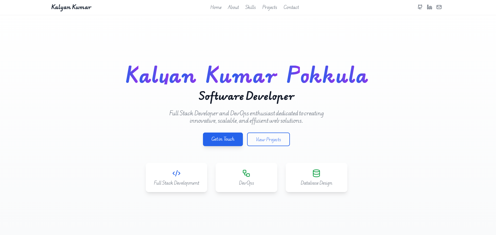
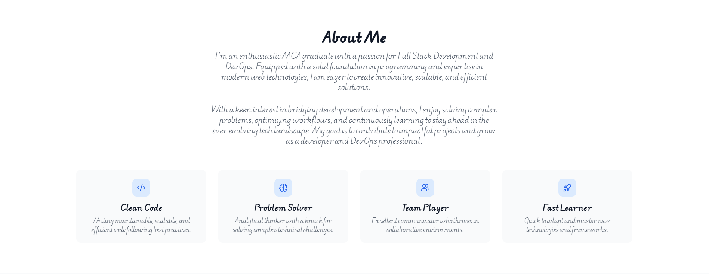
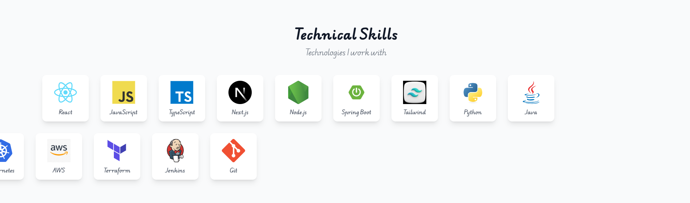
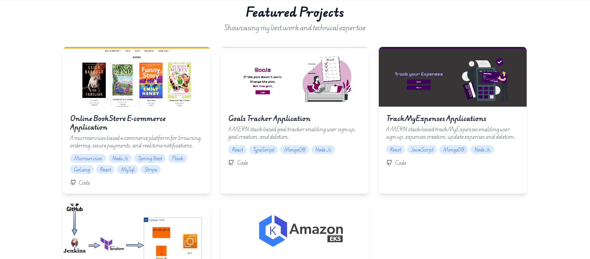
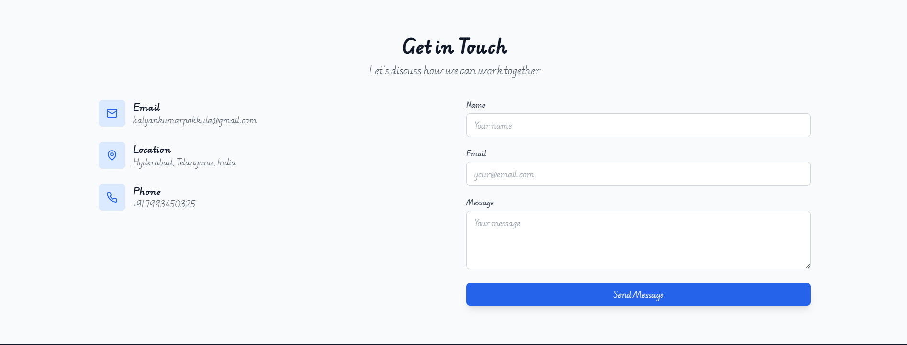

# Portfolio Website - [kalyan Kumar Pokkula]

Welcome to my portfolio website! This project showcases my skills, experience, and projects as a **Full Stack Developer** and **DevOps Engineer**. Built with a focus on simplicity and usability, it is a reflection of my journey as an **MCA graduate** with a passion for technology and innovation.

---

## 🖥️ Live Demo

Check out my portfolio: [Your Portfolio URL]

---

## 📖 About the Project

This portfolio website serves as a professional platform to display my:

- **Skills** in Full Stack Development and DevOps.
- **Personal and professional projects** that highlight my expertise.
- A **contact form** for seamless communication.

The design is clean and responsive, ensuring an engaging experience across all devices.

---

## 🚀 Features

- **Home Section**: A passionate introduction about me.
- **About Section**: Details about my skills, education, and professional journey.
- **Projects Section**: Highlight of key projects, each with descriptions, tech stacks, and links to code repositories.
- **Skills Section**: A list of my technical proficiencies.
- **Contact Section**: A form to get in touch with me directly.
- **Responsive Design**: Optimized for mobile, tablet, and desktop devices.

---

## ⚙️ Tech Stack

This portfolio is developed using:

- **Frontend**: React.js, Next.js, Tailwind CSS
- **Hosting/Deployment**: Vercel, or Netlify
- **Version Control**: Git and GitHub

---

## 🛠️ Setup & Installation

To set up this project locally:

1. Clone the repository:
   ```
   git clone https://github.com/kalyanKumarPokkula/Portfolio.git
   cd portfolio
   ```
2. Install dependencies::
   ```
   npm install
   ```
3. Start the development server:

```
npm run dev
```

## Screenshots

### Homepage



### About Page



### skills page



### projects page



### contact Page


